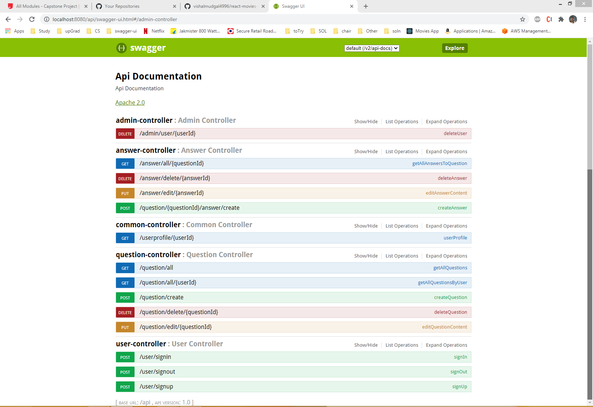
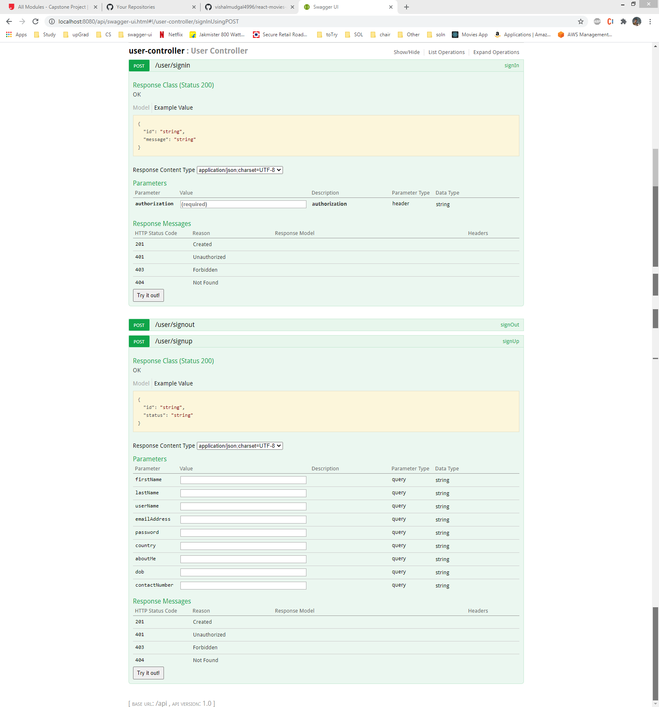
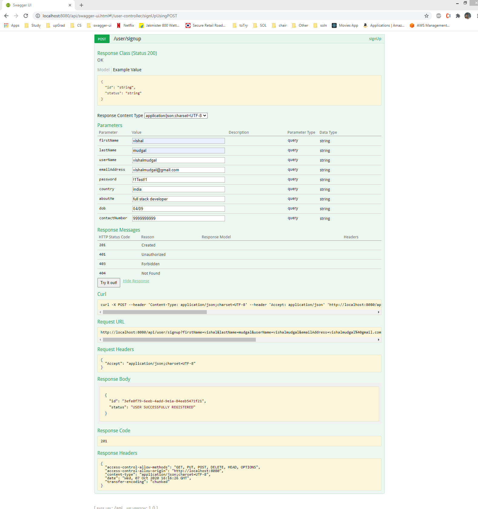
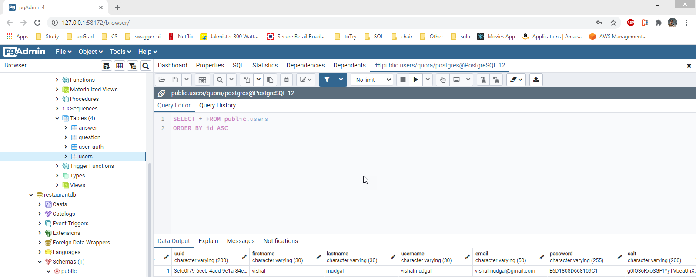

# Quora — REST Web API

A backend clone of the Quora Q&A platform built with **Java**, **Spring Boot**, **JPA/Hibernate**, and **PostgreSQL**. The project exposes a token-secured REST API that lets users sign up, sign in, post questions, answer them, manage their profile, and (as an admin) delete users.

The application is structured as a multi-module Maven project so that the persistence layer, the business logic, and the HTTP layer remain cleanly separated.

---

## Tech Stack

- **Java 8** + **Spring Boot 2.0.1**
- **Spring Web** (REST controllers)
- **Spring Data JPA / Hibernate** (persistence)
- **PostgreSQL** (database)
- **JWT (auth0 java-jwt)** (stateless authentication tokens)
- **Swagger / Springfox 2.6.1** (API documentation & code-gen)
- **JUnit + Mockito** (tests)
- **Maven** (build)

---

## Module Layout

```
quora/
├── quora-api/        # REST controllers, request/response models, Spring Boot entry point
├── quora-service/    # Business services, JPA entities, DAOs, JWT, exceptions
├── quora-db/         # SQL schema + DB configuration
├── lib/              # Bundled javax.* JARs
├── backend_screens/  # Screenshots of the running API and DB
└── pom.xml           # Parent POM aggregating the three modules
```

### `quora-api`
Spring Boot application (`QuoraApiApplication`) that boots on **port 8080** with context path **`/api`**. Contains:

- `controller/` — REST controllers (`UserController`, `CommonController`, `AdminController`, `QuestionController`, `AnswerController`)
- `exception/RestExceptionHandler` — translates service exceptions into proper HTTP error responses
- `config/SwaggerConfiguration` — Swagger UI configuration
- `resources/endpoints/*.json` — Swagger specs used by `swagger-codegen-maven-plugin` to generate the request/response model classes

### `quora-service`
Holds the domain model and business rules:

- `entity/` — JPA entities: `UserEntity`, `UserAuthTokenEntity`, `QuestionEntity`, `AnswerEntity`
- `dao/` — `UserDao`, `QuestionDao`, `AnswerDao` (JPA queries)
- `business/` — `UserBusinessService`, `UserCommonBusinessService`, `AdminBusinessService`, `QuestionBusinessService`, `AnswerBusinessService`, `PasswordCryptographyProvider`, `JwtTokenProvider`
- `exception/` — domain exceptions (`SignUpRestrictedException`, `AuthenticationFailedException`, `AuthorizationFailedException`, `SignOutRestrictedException`, `UserNotFoundException`, `InvalidQuestionException`, `AnswerNotFoundException`)
- `common/` — error codes and generic exception types

### `quora-db`
Database setup:

- `resources/sql/quora.sql` — schema for the application (`USERS`, `USER_AUTH`, `QUESTION`, `ANSWER`)
- `resources/sql/quora_test.sql` — schema for test data
- `resources/config/localhost.properties` — local DB connection details

---

## Database Schema

| Table       | Purpose                                                       |
| ----------- | ------------------------------------------------------------- |
| `USERS`     | Registered users (with `role` of `admin` / `nonadmin`)        |
| `USER_AUTH` | Issued JWT access tokens with login / expiry / logout times   |
| `QUESTION`  | Questions posted by users                                     |
| `ANSWER`    | Answers linked to a question and the answering user           |

All child tables cascade-delete on the owning user, so removing a user cleans up their questions, answers, and auth tokens.

---

## REST Endpoints

All endpoints are served under the `/api` context path. Protected endpoints require the header:

```
authorization: Bearer <access_token>
```

### User (`UserController`)
| Method | Path             | Description                                 |
| ------ | ---------------- | ------------------------------------------- |
| POST   | `/user/signup`   | Register a new user                         |
| POST   | `/user/signin`   | Sign in via Basic auth, returns JWT token   |
| POST   | `/user/signout`  | Sign out the currently authenticated user   |

### Common (`CommonController`)
| Method | Path                      | Description                                |
| ------ | ------------------------- | ------------------------------------------ |
| GET    | `/userprofile/{userId}`   | Fetch any user's public profile (auth req) |

### Admin (`AdminController`)
| Method | Path                    | Description                                          |
| ------ | ----------------------- | ---------------------------------------------------- |
| DELETE | `/admin/user/{userId}`  | Delete a user (admin role only)                      |

### Question (`QuestionController`)
| Method | Path                          | Description                                  |
| ------ | ----------------------------- | -------------------------------------------- |
| POST   | `/question/create`            | Create a new question                        |
| GET    | `/question/all`               | List all questions                           |
| PUT    | `/question/edit/{questionId}` | Edit a question (only owner)                 |
| DELETE | `/question/delete/{questionId}` | Delete a question (owner or admin)         |
| GET    | `/question/all/{userId}`      | List all questions posted by a specific user |

### Answer (`AnswerController`)
| Method | Path                                   | Description                                  |
| ------ | -------------------------------------- | -------------------------------------------- |
| POST   | `/question/{questionId}/answer/create` | Post an answer to a question                 |
| PUT    | `/answer/edit/{answerId}`              | Edit an answer (only owner)                  |
| DELETE | `/answer/delete/{answerId}`            | Delete an answer (owner or admin)            |
| GET    | `/answer/all/{questionId}`             | List all answers for a question              |

---

## Getting Started

### Prerequisites
- JDK 8
- Maven 3.x
- PostgreSQL 9+

### 1. Set up the database
Create a database called `quora` (default credentials expected by `application.yaml` are `postgres` / `postgres`):

```bash
createdb quora
psql -d quora -f quora-db/src/main/resources/sql/quora.sql
```

If you need different credentials or host/port, update `quora-api/src/main/resources/application.yaml` and `quora-db/src/main/resources/config/localhost.properties`.

### 2. Build the project
From the project root:

```bash
mvn clean install
```

This builds all three modules and runs the unit tests.

### 3. Run the API
```bash
cd quora-api
mvn spring-boot:run
```

The API will be available at:

```
http://localhost:8080/api
```

Swagger UI (when enabled) is available at:

```
http://localhost:8080/api/swagger-ui.html
```

---

## Authentication Flow

1. **Sign up** — `POST /user/signup` with the user JSON payload.
2. **Sign in** — `POST /user/signin` with a `Basic <base64(username:password)>` `authorization` header. The response includes an `access_token` HTTP header.
3. Send `authorization: Bearer <access_token>` on subsequent calls.
4. **Sign out** — `POST /user/signout` with the bearer token to invalidate it.

Passwords are hashed with `PasswordCryptographyProvider` (PBKDF2 with per-user salt). Access tokens are JWTs signed via `JwtTokenProvider` (HMAC-SHA512) and persisted in the `USER_AUTH` table for revocation.

---

## Running Tests

```bash
mvn test
```

Controller tests live in `quora-api/src/test/java/com/upgrad/quora/api/controller/`.

---

## Backend REST API — Screens








